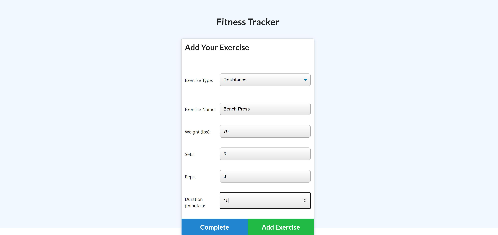
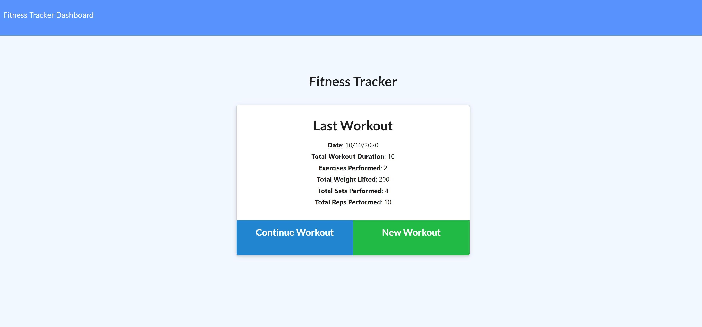
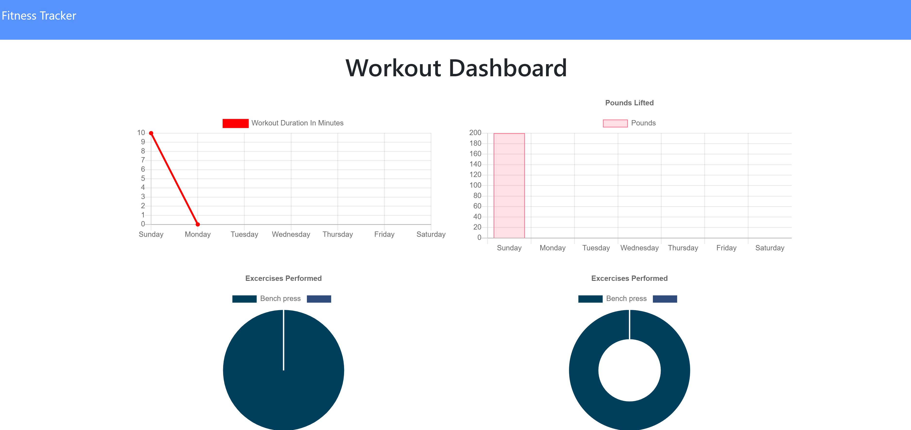

# fitness-tracker

## What is the Fitness Tracker?
This application allows you track of the exercises. The user can document  different types of exercises and reps. Also the user can update them. It also provides interactive charts and forms for the data visualization. 

## Technology
- MongoDB
- Mongoose
- Express
- Express router
- Node.js

## Deployed app
Click [here!](https://salty-chamber-96242.herokuapp.com/)

## Snapshots

* Add excercise

* After adding the excercise

* Chart after adding the excercise
